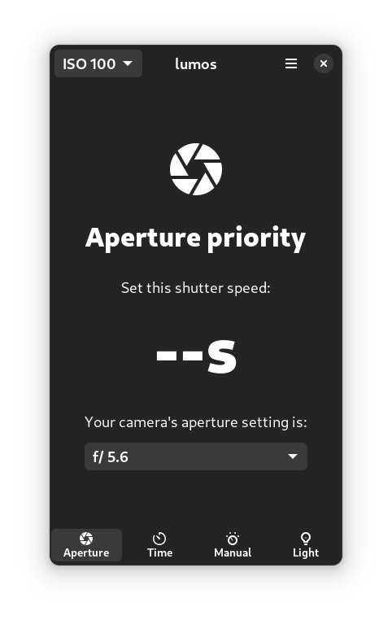

# Lumos

Incident light meter app for the Gnome/Phosh Linux On Mobile ecosystem

> NOTE: This app is under development and currently not working

Requires a phone (or tablet, or laptop) with a light sensor. If the automatic screen light setting is available on your system, it's supported.

Supports the following modes:
- Aperture priority mode: set an aperture value and the app will calculates the exposure time
- Time priority mode: set an exposure time and the app will calculates the aperture value
- Manual mode: set an exposure and aperture values and the app will show if the image is under/over/correctly exposed
- Show sensor reading mode: the app will show the reading in Lux and calculate the corresponding EV value

