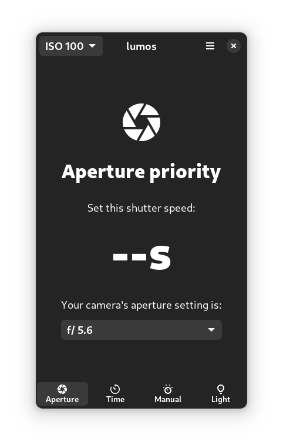

# Lumos

Incident light meter app for the Gnome/Phosh Linux On Mobile ecosystem

> This project was moved to [my private git server](https://git.ichibi.eu/penguin86/lumos) . This repository may not be up to date.

> NOTE: This app is under development and currently not working

Requires a phone (or tablet, or laptop) with a light sensor. If the automatic screen light setting is available on your system, it's supported.

Supports the following modes:
- Aperture priority mode: set an aperture value and the app will calculates the exposure time
- Time priority mode: set an exposure time and the app will calculates the aperture value
- Manual mode: set an exposure and aperture values and the app will show if the image is under/over/correctly exposed
- Show sensor reading mode: the app will show the reading in Lux and calculate the corresponding EV value

## How to contribute

The project is open to contribution, but with some limits:

- I'm sorry I can't accept AI-generated contributions. Reviewing a contribution requires time and effort from my side, while generating code with AI requires very little time and produces non reliable code that must be reviewed in detail. This is effectively shifting the work on my side, and in a forced way. If you feel you need a feature but you're not able to implement it by yourself, I prefer you to create an issue in the repository so I can implement it when I can, in a more mantainable way.
- Before implementing a big change, please contact me to ensure it goes in the project's direction.
- If working on an existing ticket, please name the branch accordingly (feature/ticketNumber, bugfix/ticketNumber...).
- Only issue pull requests to the develop branch, never on the main/master one.

Please see the main repository README file on how to obtain an account to my git instance.

